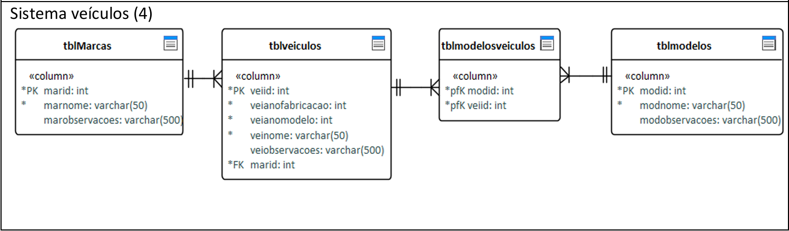
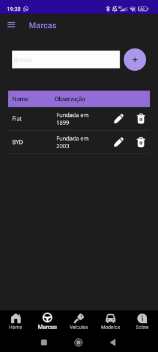

# 🚗 Aplicativo de Gestão de Veículos

Aplicativo mobile para gerenciamento de estoque de veículos, desenvolvido com **.NET MAUI**. Permite cadastrar, editar, listar e pesquisar veículos de forma prática, com persistência de dados local.
Este projeto foi desenvolvido como parte dos meus estudos em desenvolvimento mobile, com foco em aplicações reais usando C# e .NET.


---

## 📱 Funcionalidades

- Cadastro de marcas, modelos, veículos.
- Pesquisa de registros.
- Edição e exclusão de registros
- Armazenamento local (SQLite)

<p align="center">
  
</p>

---

## 🛠️ Tecnologias Utilizadas

- [.NET MAUI](https://learn.microsoft.com/pt-br/dotnet/maui/)
- C#
- SQLite (com `sqlite-net-pcl`)

---

## ⚙️ Como Executar o Projeto

### Pré-requisitos

- [.NET 8 SDK](https://dotnet.microsoft.com/en-us/download)
- Visual Studio 2022 (ou mais recente) com o **workload do MAUI instalado**

### Passos

1. Clone o repositório:

```bash
git clone https://github.com/gmalisse/vehicles-app.git
```

2. Abra a solução no Visual Studio:

- Localize e abra o arquivo .sln (solução);
- Escolha o emulador ou dispositivo desejado (Android, iOS ou Windows). Por conta de diferenças entre layouts, a parte visual do aplicativo não funciona da maneira esperada ao selecionar a opção Windows Machine.
Os emuladores android são bem pesados, e por isso, deixam a desejar em performance. Recomendo utilizar seu próprio dispositivo móvel para depurar. Para isso, é necessário habilitar as configurações de desenvolvedor nele:

#### 🔧 Como ativar o modo desenvolvedor no Android:

1. Acesse as Configurações do seu celular Android;
2. Vá até Sobre o telefone;
3. Toque 7 vezes em **Número da versão** até ver a mensagem:  
   *"Você agora é um desenvolvedor!"*
4. Volte ao menu principal de Configurações;
5. Procure por "Opções do desenvolvedor”;
6. Ative as opções **Depuração USB** e **Instalar via USB**;
7. Conecte o celular via cabo USB e autorize a depuração quando solicitado na tela do dispositivo.
   
- Clique em "Iniciar" (F5) para compilar e executar o app.


